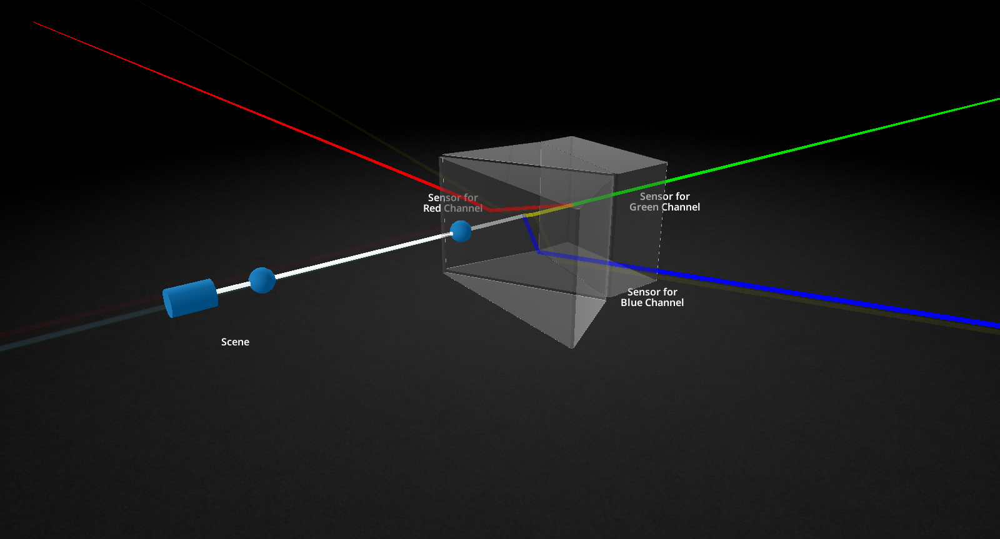
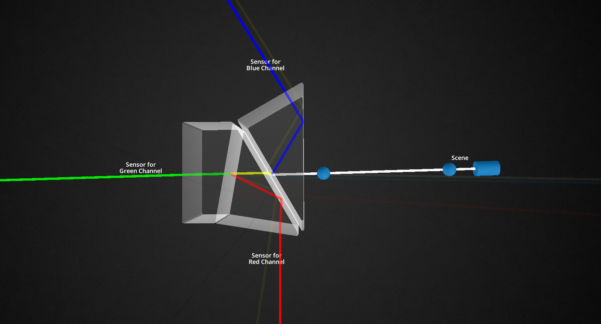

# Trichroic Prism Visualization

In a [3-CCD camera](https://en.wikipedia.org/wiki/Three-CCD_camera), white light from the lens hits a trichroic prism assembly
that splits it into red, green, and blue—each path goes to its own sensor.
No Bayer filter, no guessing missing colors: sharper detail and cleaner color
on fine patterns (think stadium turf or striped fabric).

This program lets you explore that stack in 3D: three prisms, two polarizing
filters, and visible dispersion. It is also a compact example of [VTK](https://vtk.org/) with
interactive widgets and custom shaders.


## Screenshots

<a href="https://raw.githubusercontent.com/kamilprusko/prism/master/screenshots/1.png" target="_blank">
  
</a>
<br/>

<a href="https://raw.githubusercontent.com/kamilprusko/prism/master/screenshots/2.png" target="_blank">
  
</a>
<br/>

## Build and run

### From source

**Requirements:** [VTK](https://vtk.org/) 9.x, [Meson](https://mesonbuild.com/) ≥ 1.3, and Ninja.
Install VTK development files so CMake finds `VTKConfig.cmake` (e.g. `vtk-devel` on Fedora).

```sh
meson setup --reconfigure build --prefix=$PWD/.install
meson compile -C build
meson install -C build
.install/bin/prism
```

If VTK is not on the default search path:

```sh
meson setup build --cmake-prefix-path=/path/to/vtk/prefix
```

### Flatpak

Requires `flatpak`, `flatpak-builder`, and the Freedesktop 24.08 SDK/runtime.
The first build compiles VTK and can take a while.

```sh
flatpak-builder --user --install --force-clean _flatpak_build io.github.kamilprusko.Prism.json
flatpak run io.github.kamilprusko.Prism
```
